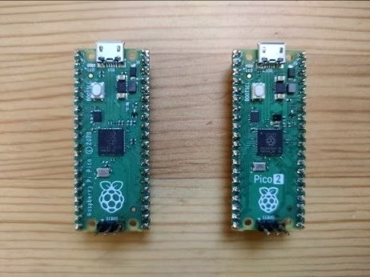

# pico-jxgLABO

## What's this?

This is a project for Raspberry Pi Pico that provides a command-line interface to control GPIO, ADC, PWM, I2C, and SPI functionalities. It is designed to work with the jxglib library, which is a C++ library for embedded systems that provides a set of tools to easily manage hardware components.



## Environment

- Raspberry Pi Pico or Pico2
- Terminal emulator (e.g., Tera Term, PuTTY)

If you want to customize the source code, you will also need:

- Visual Studio Code (installed with Raspberry Pi Pico extension)

## How to install

Download the latest release of the binary file for your Raspberry Pi Pico from the following links:

- For Pico ... [pico-jxgLABO.uf2](https://github.com/ypsitau/pico-jxgLABO/releases/latest/download/pico-jxgLABO.uf2)
- For Pico 2 ... [pico2-jxgLABO.uf2](https://github.com/ypsitau/pico-jxgLABO/releases/latest/download/pico2-jxgLABO.uf2)

Connect your Raspberry Pi Pico to your computer's USB port while holding down the BOOTSEL button. This will mount the Pico as a mass storage device. If you are using Windows, it will appear as a drive (e.g., D:). Once mounted, you can copy the generated binary to the Pico.

After copying the binary, the Pico will reboot and start running the program.

## How to use

Once the Pico is running, you can connect to it using a terminal emulator. Set the serial port to the appropriate COM port (e.g., COM7) and the baud rate to 115200. You will see a command prompt like this:

```text
L:/>
```

Type `help` to see available commands.

## Pages


  
- [{{ file.basename }}]({{ file.path | remove_first: '/' }})
  


## License

This project is licensed under the MIT License - see the [LICENSE.md](LICENSE.md) file for details.
